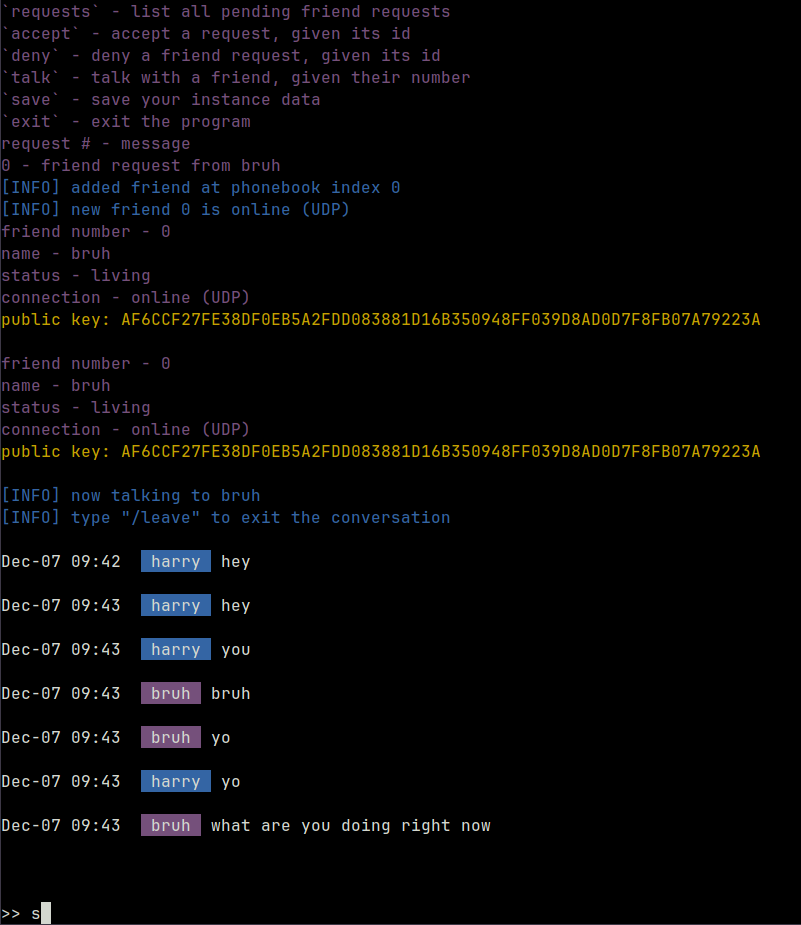
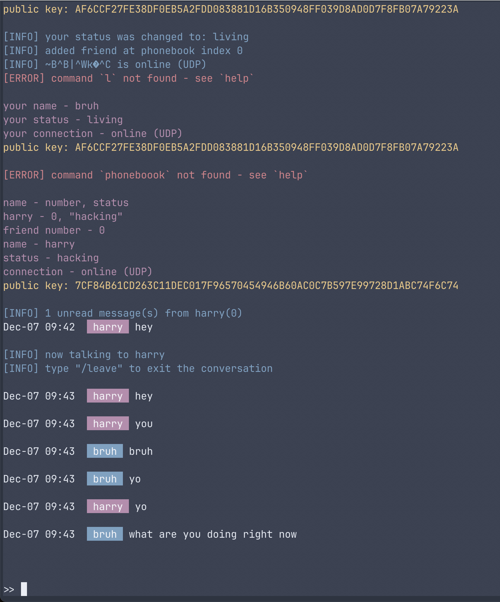

# Talk

.row {
    display: flex;
}

.column {
    flex: 33.33%;
    padding: 5px;
}

<div class="row">
    <div class="column">
        
    </div>
    <div class="column">
        
    </div>
</div>


*Used as a final project for CS3520 @ NU*

Talk is an encrypted, peer-to-peer messaging client for [Tox](https://github.com/TokTok/c-toxcore/).


# Dependencies

For this program to work, [install Tox, and all of its dependencies](https://github.com/TokTok/c-toxcore/blob/master/INSTALL.md#requirements) (most notably, [sodium](https://doc.libsodium.org/installation)).

For UI, also make sure you have `ncurses` installed (comes preinstalled on most *nix machines).


# How to Build

After installing the necessary dependencies, use the provided [CMakeLists.txt](./CMakeLists.txt) to build with CMake.
```
mkdir build
cd build
cmake ..
```

Alternatively, build with `g++`:
```
g++ -std=c++17 lib/include/* main.cpp -lpthread -lsodium -ltoxcore -lcurses -o talk
```

Then, run with `./talk`
